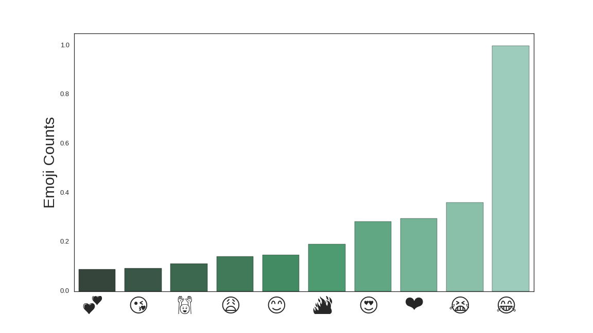
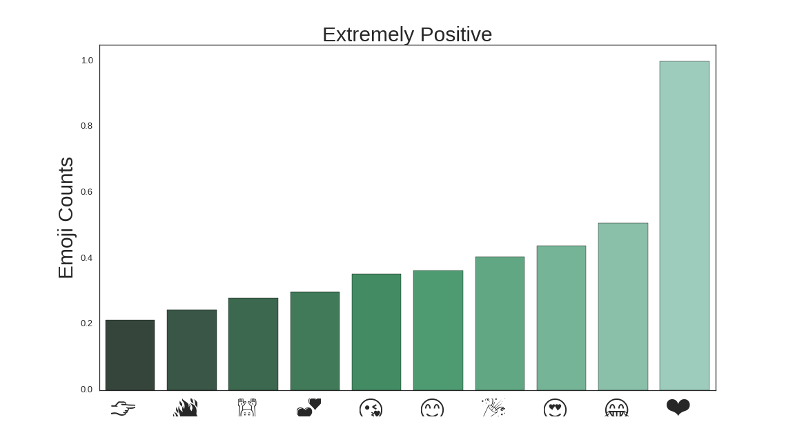
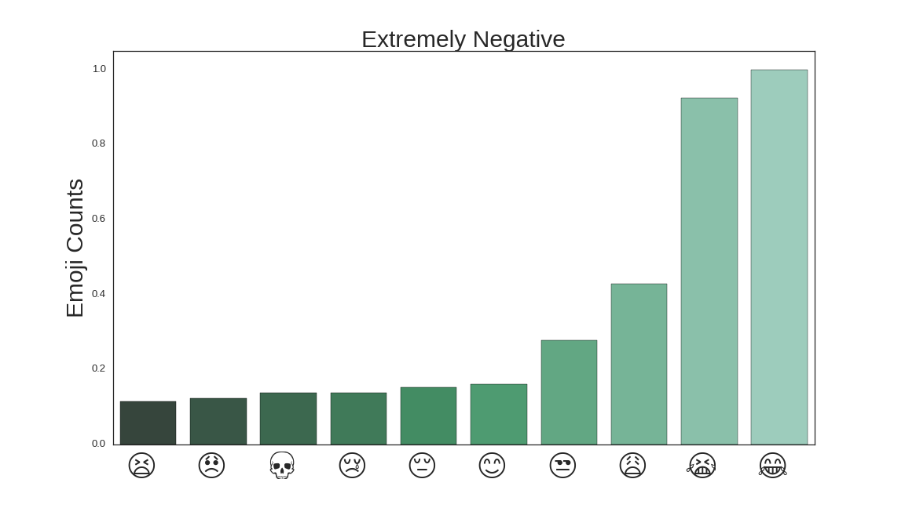
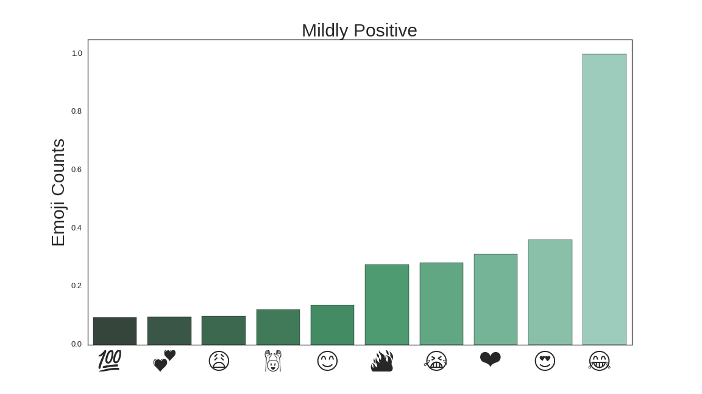
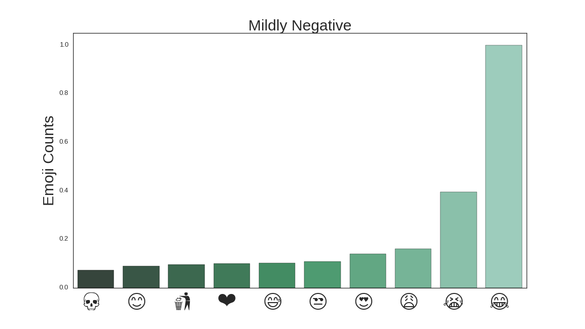
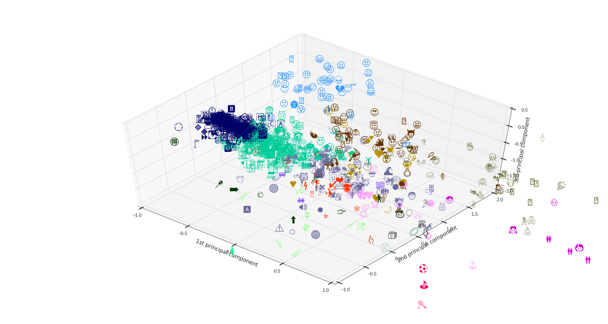

# emoji_prediction

## Motivation:
Emoji has been a part of our everyday life that capture of emotions and ideas better than text. It also serves as a language that overcome language barriers. In this project I'm trying to predict the Emoji uses to help and encourage use of Emoji.

## Method:
In this project, I use a n_gram language model to predict the next words and extract the emojis people have used given the preceding words. Since the combination of words following an emoji is not common since there's only 2-5 emojis per tweets if it exist, a word2vec model were use to assist the prediction of emojis. Finally, the sentiment of the tweets were taken into account and add into interpolation with n_gram models to assist prediction based on the sentiment.

## Data Pipeline:
1. Data Aquisition: The data were acquired from twitter firehose with up to a million tweets in the format of json

2. Data Munging: The tweets was turned into Spark rdd, filter out tweets that's not english and get the text from json. The Emojis treated as a word by separating them and add start and end tags to the string.

3. N_gram Model: bigram, trigram and quadgram model were trained using the corpus acquired previously. For the prediction, a simple linear interpolation model using bigram, trigram and quadgram is used with adjustable weights for each model.

4. Word2Vec: word2vec model is trained with Spark MLLib library and the vectors for different words and emojis were used to assist prediction in the case of no emoji following the preceding word combinations.

5. Sentiment Analysis: a naive bayes model were trained on sentiment analysis corpus (obtained through [Sentiment140](http://help.sentiment140.com/for-students/)) based on tweets. The tweet sentiment were then divided into four categories (extremely positive, mildly positive, mildly negative, extremely negative) based on it's probability of being a positve tweets. The conditional probability of different sentiment were than calculated for each emoji and add into the interpolation model to assist prediction.

## Data Analysis:
1. Usage of Emojis on twitter: Here are the discovery for the top 10 usage for emojis on twitter

It's worth noting that the LOL face with tears has more than double the count of all the other emojis.
I than look at the emoji usage under different sentiments.

    

    

    
    

    The result shows that  no matter the sentiment, the LOL face with tears are always on top of the usage list.
    some tweets that's extremely negative with lol face

    * i hate you 😂💀
    * it's sad how true this is 😂
    * this is literally me its so sad 😂😂😂😂😂

    and tweets that's extremely positive

    * yeah your welcome lol😂
    * this is great haha 💀😂
    * lmao disney was great👌😂😂

    According to emojipedia

        >A laughing emoji which at small sizes is often mistaken for being tears of sadness.

    which could be the reason of the phenomenon

2. Word2Vec Model: the Word2Vect has been a extremely useful tool for featurization for text. The following plot visually inspect the result of the Word2Vec model based on my tweet corpus.

    

    The result shows that the emoji were correctly classified based on , negative emotions, positive emotions, objects, hearts...etc. One should notcie that the lol negative face is incorrectly clustered into the negative emotions group due to the broad usage of this emoji.
